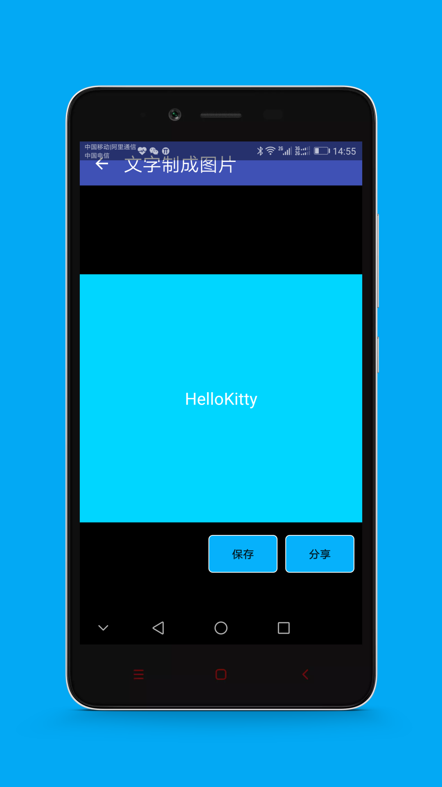
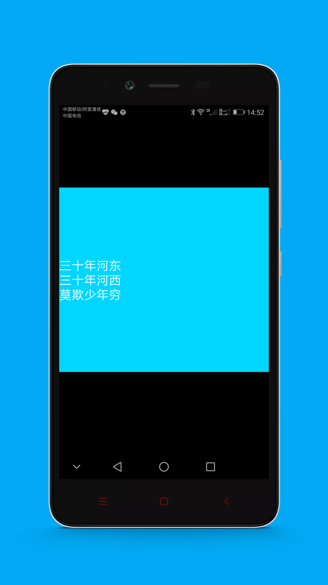
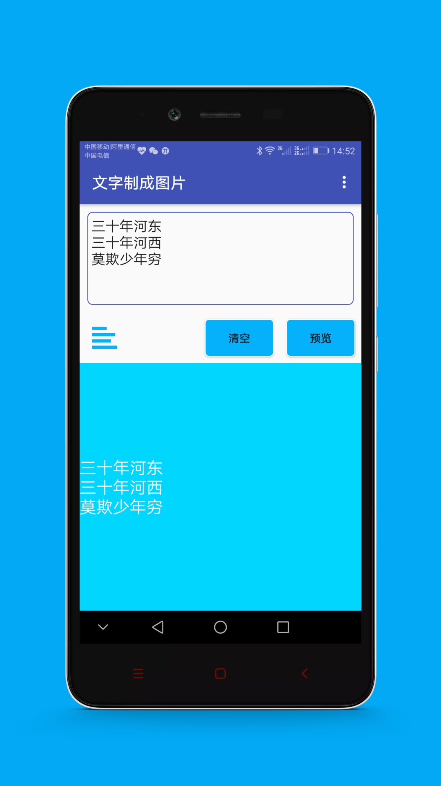
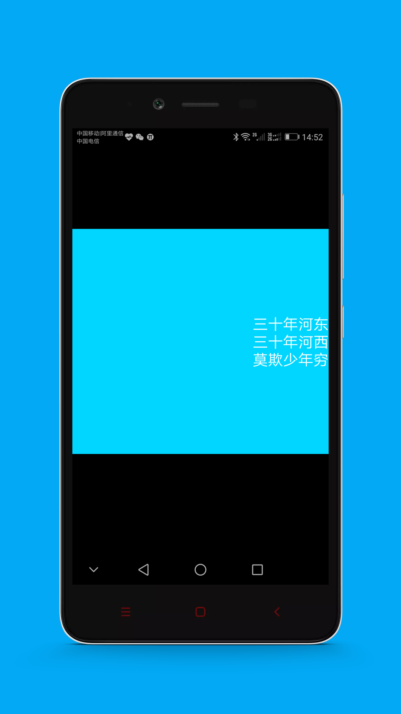
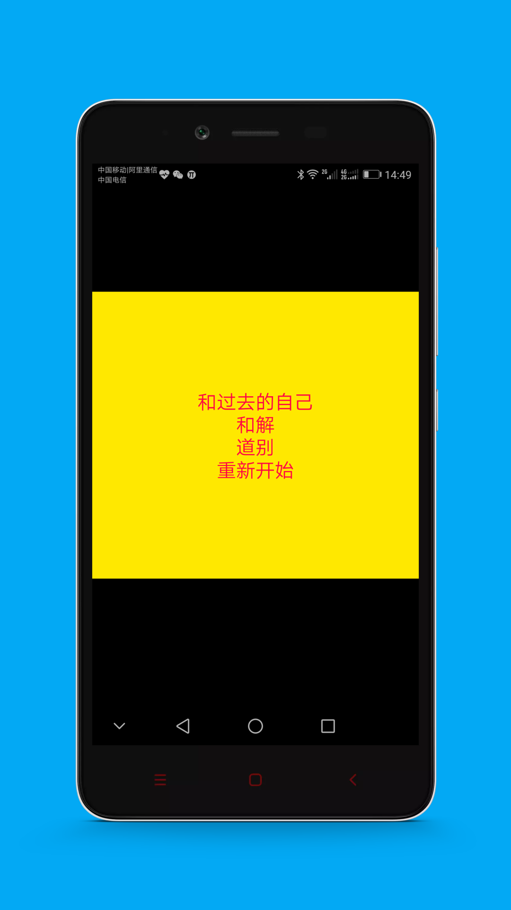

# TextImageMaker

将文字制作成图片

将输入的文字制作成图片，以此方便用于在朋友圈动态的内容上发布时不再为没有图片而烦恼。

#### 功能：
1. 可以选择图片背景;
2. 可以指定文字的风格：颜色等;
3. 可以一键分享到社交平台，如朋友圈;
4. 自定义文本位置，居中，居左和居右

#### 快照

#### License

All source code is licensed under Apache License 2.0. If you create your own app (free or commercial) that uses some or all of the code from this codebase, you MUST attribute it to the original author, no exceptions. You can do so by displaying an "About" or "Licenses" screen in your app that links back to this GitHub page AND includes the following notice: 

    Copyright 2014 - Saravan Pantham

    Licensed under the Apache License, Version 2.0 (the "License");
    you may not use this file except in compliance with the License.
    You may obtain a copy of the License at

       http://www.apache.org/licenses/LICENSE-2.0

    Unless required by applicable law or agreed to in writing, software
    distributed under the License is distributed on an "AS IS" BASIS,
    WITHOUT WARRANTIES OR CONDITIONS OF ANY KIND, either express or implied.
    See the License for the specific language governing permissions and
    limitations under the License.
